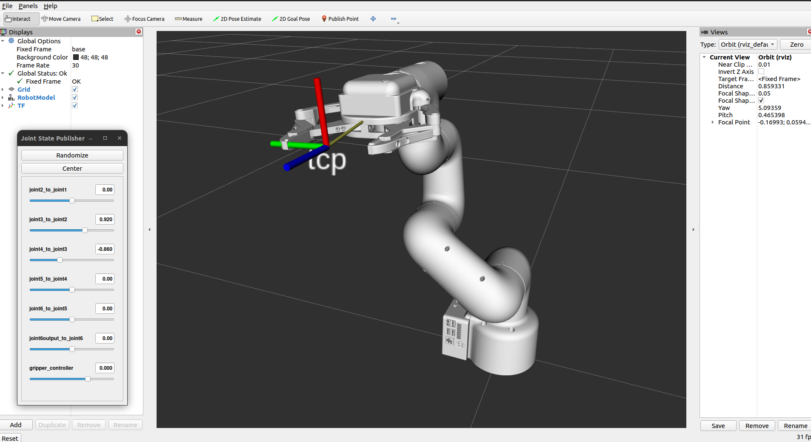
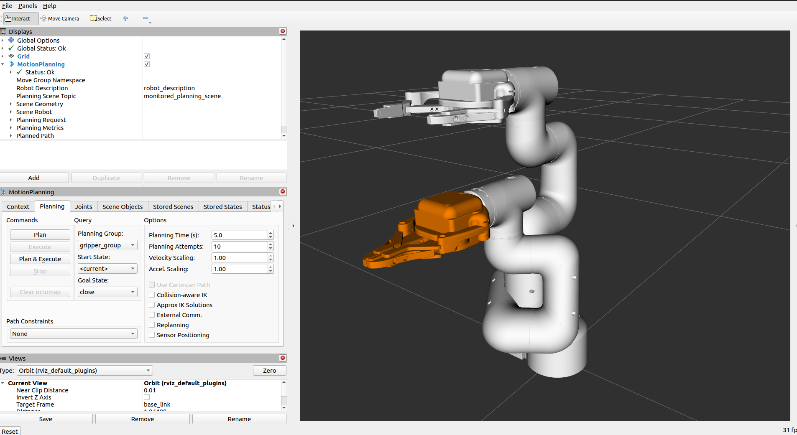
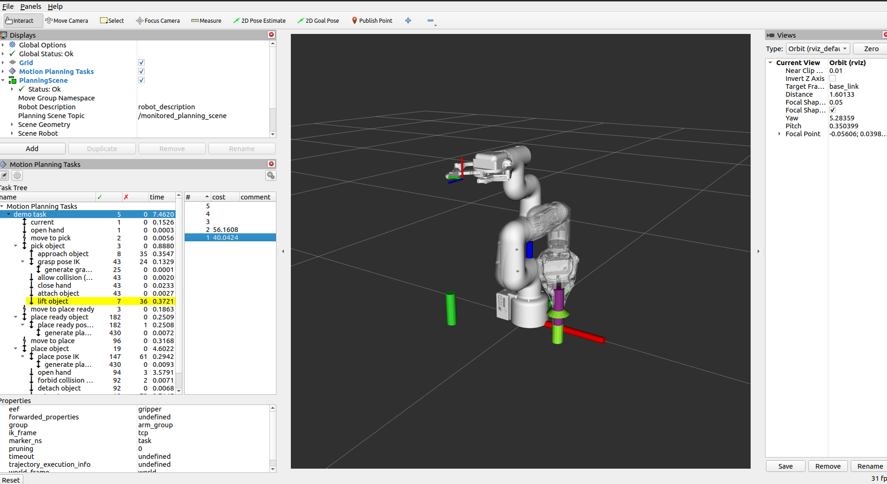

# mycobot320pi_gripper_moveit2

This project is demonstrates a setup of the MyCobot 320pi robot with the MyCobot Pro Adaptive Gripper for simulation and *control using the planning capabilities of [MoveIt 2](https://moveit.ros.org/). 

The project also uses [MoveIt Task Constructor Framework](https://github.com/moveit/moveit_task_constructor.git) to simulate a simple pick and place task.


The main branch is configured for [ROS2 Humble Hawksbill](https://docs.ros.org/en/humble/Installation.html).

## Setup
1. Create workspace and clone the repository

```
mkdir -p mycobot_320pi/src
cd mycobot_320pi/src 

git clone https://github.com/MasterpieceNKA/mycobot320pi_gripper_moveit2.git
``` 

2. Install dependencies

```
for repo in mycobot320pi_gripper_moveit2/mycobot_320pi.repos; do vcs import < "$repo"; done

rosdep install -r --from-paths . --ignore-src --rosdistro $ROS_DISTRO -y
```

3. Build workspace

```
cd .. 

colcon build --mixin release --executor sequential --parallel-workers 1
```
## Running robot simulation demo
 
Open new terminal and run

```
source install/setup.bash  && ros2 launch mycobot_320pi demo.launch.py
```  



## Running MoveIt 2 demo
 
Open new terminal and run

```
source install/setup.bash  && ros2 launch demo_mycobot_320pi demo.launch.py
```  



## Running MoveIt Task demo
 
Open new terminal and run

```
source install/setup.bash  && ros2 launch demo_mycobot_320pi pick_place.launch.py
``` 




